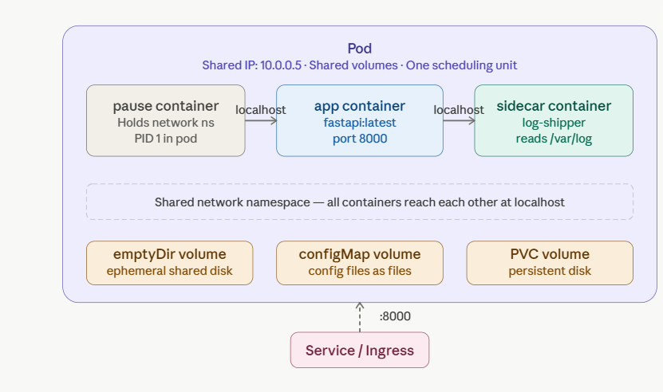
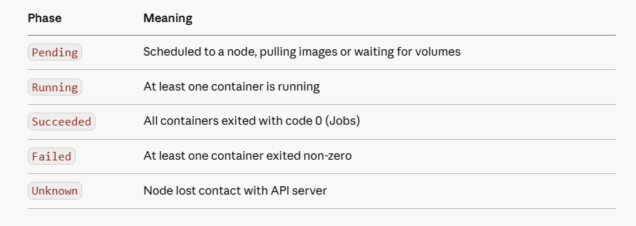
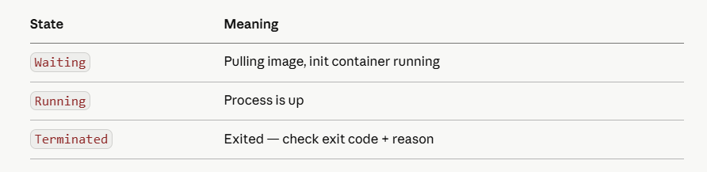
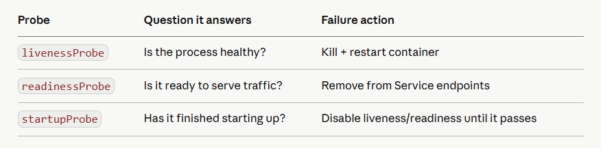
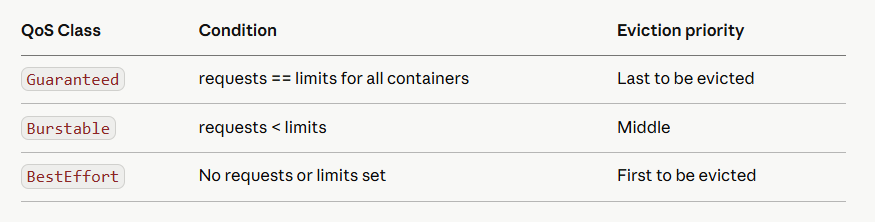

# Day 2 — Pods Deep Dive
Pods are the atomic unit of Kubernetes. Everything runs inside a Pod. Master this and you master the foundation of CKAD + CKA both.

## Part 1: What Actually IS a Pod?
A Pod is not a container. It's a wrapper around one or more containers that share the same network namespace and storage. Think of it as a tiny VM — all containers inside one Pod share the same IP address and can talk to each other via localhost.



The pause container is K8s's secret — it boots first, claims the network namespace and IP, and all other containers in the Pod join it. That's why containers in a Pod share an IP.

## Part 2: Pod Lifecycle
A Pod moves through these phases. Knowing them deeply is pure CKA/CKAD exam gold.



Container states (different from Pod phases):



```
# See both pod phase AND container states
kubectl describe pod <pod-name>

# Quick phase check
kubectl get pod <pod-name> -o jsonpath='{.status.phase}'

# Container state detail
kubectl get pod <pod-name> -o jsonpath='{.status.containerStatuses[*].state}'
```

## Part 3: Init Containers
Init containers run before your main container, sequentially, and must complete successfully. Perfect for: DB migrations, config seeding, waiting for a dependency.

```
apiVersion: v1
kind: Pod
metadata:
  name: url-shortener
spec:
  initContainers:
  - name: wait-for-redis
    image: busybox:1.35
    command: ['sh', '-c', 
      'until nc -z redis-service 6379; do echo waiting for redis; sleep 2; done']
  
  - name: db-migrate
    image: your-fastapi:latest
    command: ['python', 'manage.py', 'migrate']
    env:
    - name: DATABASE_URL
      valueFrom:
        secretKeyRef:
          name: app-secrets
          key: database-url

  containers:
  - name: fastapi
    image: your-fastapi:latest
    ports:
    - containerPort: 8000
```

Init containers have their own resource requests — they don't run concurrently, so K8s only allocates the max of all init containers, not the sum.

## Part 4: Multi-Container Patterns
These three patterns come up in CKAD exams every single time.

### Pattern 1: Sidecar
Enhances the main container. Runs alongside it the whole time.

```
# Log shipper sidecar — reads logs written by the app
spec:
  containers:
  - name: fastapi
    image: your-fastapi:latest
    volumeMounts:
    - name: logs
      mountPath: /var/log/app

  - name: log-shipper        # sidecar
    image: fluentd:latest
    volumeMounts:
    - name: logs
      mountPath: /var/log/app   # same volume — reads what fastapi writes

  volumes:
  - name: logs
    emptyDir: {}
```

### Pattern 2: Ambassador
Proxy that handles network complexity for the main container.

```
# Main app talks to localhost:5432 — ambassador routes to the real DB
spec:
  containers:
  - name: fastapi
    image: your-fastapi:latest
    env:
    - name: DB_HOST
      value: localhost           # talks to ambassador, not real DB

  - name: db-ambassador         # ambassador
    image: haproxy:latest
    # routes localhost:5432 → actual-postgres-service:5432
```

### Pattern 3: Adapter
Transforms output from the main container into a standard format.

```
# App emits custom metrics — adapter converts to Prometheus format
spec:
  containers:
  - name: fastapi
    image: your-fastapi:latest

  - name: metrics-adapter       # adapter
    image: prometheus-adapter:latest
    ports:
    - containerPort: 9090        # exposes /metrics in Prometheus format
```

### Part 4: Probes — The Most Exam-Tested Topic
Three probe types. Every senior K8s engineer must know the difference cold.



```
containers:
- name: fastapi
  image: your-fastapi:latest
  ports:
  - containerPort: 8000

  # startupProbe: give slow apps time to boot (disables liveness during startup)
  startupProbe:
    httpGet:
      path: /health
      port: 8000
    failureThreshold: 30      # 30 × 10s = 5 min max startup time
    periodSeconds: 10

  # livenessProbe: restart if app deadlocks or gets stuck
  livenessProbe:
    httpGet:
      path: /health
      port: 8000
    initialDelaySeconds: 0    # startupProbe handles initial delay
    periodSeconds: 10
    failureThreshold: 3       # 3 failures = restart

  # readinessProbe: only send traffic when truly ready
  readinessProbe:
    httpGet:
      path: /ready              # /ready checks DB connection, cache warmup etc.
      port: 8000
    periodSeconds: 5
    failureThreshold: 2         # pulled from Service after 2 failures
```

Using livenessProbe on a /ready endpoint that depends on a downstream service = cascading restarts across your fleet when that service goes down. Always use readinessProbe for dependency checks, livenessProbe only for the process itself.

### Part 5: Resources & QoS Classes

```
containers:
- name: fastapi
  resources:
    requests:               # what K8s GUARANTEES — used for scheduling
      memory: "128Mi"
      cpu: "250m"           # 250 millicores = 0.25 CPU
    limits:                 # hard ceiling — exceeding memory = OOMKilled
      memory: "256Mi"
      cpu: "500m"           # exceeding CPU = throttled (not killed)
```

Kubernetes assigns a QoS class automatically:



```
kubectl get pod <name> -o jsonpath='{.status.qosClass}'
```

### Part 6: Hands-On Exercises
Exercise 1: Deploy your URL shortener as a Pod with probes

```
cat <<EOF | kubectl apply -f -
apiVersion: v1
kind: Pod
metadata:
  name: url-shortener
  labels:
    app: url-shortener
spec:
  initContainers:
  - name: wait-for-redis
    image: busybox:1.35
    command: ['sh','-c','until nc -z localhost 6379; do sleep 1; done']

  containers:
  - name: fastapi
    image: python:3.11-slim
    command: ["python","-m","http.server","8000"]  # stand-in for your app
    resources:
      requests:
        memory: "64Mi"
        cpu: "100m"
      limits:
        memory: "128Mi"
        cpu: "200m"
    livenessProbe:
      httpGet:
        path: /
        port: 8000
      initialDelaySeconds: 5
      periodSeconds: 10
    readinessProbe:
      httpGet:
        path: /
        port: 8000
      initialDelaySeconds: 3
      periodSeconds: 5
EOF
```

Exercise 2: Observe pod lifecycle in real time

```
# Watch the pod go through phases
kubectl get pod url-shortener -w

# See init container running
kubectl logs url-shortener -c wait-for-redis

# See events (scheduling, pulling, starting)
kubectl describe pod url-shortener | grep -A 20 Events

# Check QoS class
kubectl get pod url-shortener -o jsonpath='{.status.qosClass}'
```

Exercise 3: Trigger a liveness failure

```
# Exec into pod and kill the process — watch K8s restart it
kubectl exec -it url-shortener -- kill 1

# Watch the restart counter increment
kubectl get pod url-shortener -w
# You'll see RESTARTS go from 0 → 1
```

Exercise 4: Multi-container sidecar pod

```
cat <<EOF | kubectl apply -f -
apiVersion: v1
kind: Pod
metadata:
  name: sidecar-demo
spec:
  containers:
  - name: writer
    image: busybox
    command: ['sh','-c','while true; do date >> /logs/app.log; sleep 2; done']
    volumeMounts:
    - name: shared-logs
      mountPath: /logs

  - name: reader          # sidecar reading the same volume
    image: busybox
    command: ['sh','-c','tail -f /logs/app.log']
    volumeMounts:
    - name: shared-logs
      mountPath: /logs

  volumes:
  - name: shared-logs
    emptyDir: {}
EOF

# Watch the sidecar reading what the writer writes
kubectl logs sidecar-demo -c reader -f
```

### Part 7: Interview Questions — Day 2
Q1: What's the difference between livenessProbe and readinessProbe?

Liveness: "is the process alive?" — failure restarts the container. Readiness: "is it ready for traffic?" — failure removes it from Service endpoints without restarting. A pod can be Running but not Ready.

Q2: You have a slow-starting Java app that takes 3 minutes to boot. How do you configure probes?

Use startupProbe with failureThreshold: 18 and periodSeconds: 10 (= 3 min). Once it passes, liveness kicks in. Without startupProbe, liveness would kill it before it finishes booting.

Q3: What is a QoS class and why does it matter?

Kubernetes uses QoS to decide which pods to evict under memory pressure. Guaranteed pods (requests == limits) are evicted last. BestEffort (no requests/limits) are first. Critical production pods should be Guaranteed.

Q4: Two containers in a Pod — can they share files?

Yes — mount the same emptyDir volume in both containers. They share the same filesystem path. This is the sidecar pattern's core mechanism.

Q5: What happens to an emptyDir volume when a pod restarts vs is deleted?

Container restart (same pod): emptyDir persists. Pod deletion: emptyDir is gone permanently. Use a PVC if you need data to survive pod deletion.

Q6: What is the pause container?

Every pod has a hidden pause container injected by kubelet. It holds the network namespace (IP address) for the pod. All app containers join this network. If the pause container dies, all containers in the pod restart.

