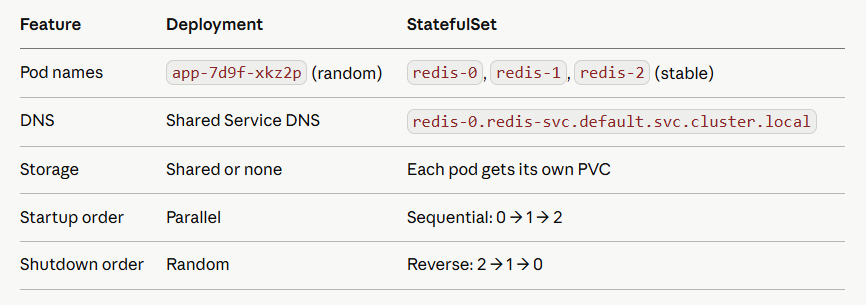

# Day 3 — Workload Controllers
Pods alone are mortal. Controllers are what make Kubernetes self-healing. Today you master every controller — this is pure CKA + CKAD exam weight.

## Part 1: The Controller Pattern
Every controller in K8s runs the same loop:

Observe current state → Compare to desired state → Act to reconcile
This is called the reconciliation loop. It never stops. If you delete a pod managed by a Deployment, the controller notices within seconds and creates a new one. That's the entire magic of Kubernetes.

## Part 2: Deployments — The Workhorse
You'll use Deployments for 90% of workloads. Know every field cold.

```
apiVersion: apps/v1
kind: Deployment
metadata:
  labels:
    app: nginx-deploy
  name: nginx-deploy
spec:
  replicas: 3
  selector:
    matchLabels:
      app: nginx-deploy
  strategy:
    type: RollingUpdate
    rollingUpdate:
      maxSurge: 1               # extra pods above desired during update
      maxUnavailable: 0
  template:
    metadata:
      labels:
        app: nginx-deploy
    spec:
      containers:
      - image: nginx
        name: nginx
        resources: 
          requests:
            memory: "64Mi"
            cpu: "100m"
          limits:
            memory: "128Mi"
            cpu: "200m"
        readinessProbe:
          httpGet:
            path: /
            port: 80
          initialDelaySeconds: 3
          periodSeconds: 5
```

Rolling update deep dive

```
# Trigger a rolling update
kubectl set image deployment/nginx-deploy nginx=nginx:1.26

# Watch it roll out live
kubectl rollout status deployment/nginx-deploy

# See rollout history
kubectl rollout history deployment/nginx-deploy

# Rollback to previous version instantly
kubectl rollout undo deployment/nginx-deploy

# Rollback to specific revision
kubectl rollout undo deployment/nginx-deploy --to-revision=2

# Pause mid-rollout (canary-like)
kubectl rollout pause deployment/nginx-deploy
# ... verify some pods on new version ...
kubectl rollout resume deployment/nginx-deploy
```

Interview gold: maxSurge: 1, maxUnavailable: 0 = zero-downtime deploy. maxSurge: 0, maxUnavailable: 1 = resource-constrained deploy (never exceed capacity). Know when to use each.

## Part 3: StatefulSets — For Stateful Apps
StatefulSets give each pod a stable, sticky identity that survives rescheduling. This is fundamentally different from Deployments.



```
apiVersion: apps/v1
kind: StatefulSet
metadata:
  name: redis
spec:
  serviceName: redis-headless    # headless service — required for stable DNS
  replicas: 3
  selector:
    matchLabels:
      app: redis
  template:
    metadata:
      labels:
        app: redis
    spec:
      containers:
      - name: redis
        image: redis:7-alpine
        ports:
        - containerPort: 6379
        volumeMounts:
        - name: data
          mountPath: /data
  volumeClaimTemplates:          # each pod gets its OWN PVC — key difference
  - metadata:
      name: data
    spec:
      accessModes: ["ReadWriteOnce"]
      resources:
        requests:
          storage: 1Gi
---
# Headless service — no ClusterIP, enables stable DNS per pod
apiVersion: v1
kind: Service
metadata:
  name: redis-headless
spec:
  clusterIP: None                # this makes it headless
  selector:
    app: redis
  ports:
  - port: 6379
```

After deploy: redis-0, redis-1, redis-2 each get their own PVC (data-redis-0, data-redis-1, data-redis-2) and reachable at redis-0.redis-headless.default.svc.cluster.local.

## Part 4: DaemonSets
Ensures one pod runs on every node (or a subset). New node joins? DaemonSet pod spawns automatically.

```
apiVersion: apps/v1
kind: DaemonSet
metadata:
  name: node-exporter
spec:
  selector:
    matchLabels:
      app: node-exporter
  template:
    metadata:
      labels:
        app: node-exporter
    spec:
      tolerations:
      # run on control-plane nodes too (they have this taint by default)
      - key: node-role.kubernetes.io/control-plane
        operator: Exists
        effect: NoSchedule
      containers:
      - name: node-exporter
        image: prom/node-exporter:latest
        ports:
        - containerPort: 9100
        volumeMounts:
        - name: proc
          mountPath: /host/proc
          readOnly: true
      volumes:
      - name: proc
        hostPath:
          path: /proc
```

Common DaemonSet use cases: Prometheus node-exporter, Fluentd/Filebeat log shipping, CNI plugins, storage drivers, security agents (Falco).

## Part 5: Jobs & CronJobs
Job — run once to completion

```
apiVersion: batch/v1
kind: Job
metadata:
  name: db-migrate
spec:
  completions: 1          # total successful runs needed
  parallelism: 1          # pods running simultaneously
  backoffLimit: 4         # retry up to 4 times before marking failed
  activeDeadlineSeconds: 300   # kill after 5 min no matter what
  template:
    spec:
      restartPolicy: OnFailure  # Never or OnFailure — NOT Always
      containers:
      - name: migrate
        image: ghcr.io/youruser/url-shortener:v3
        command: ["python", "manage.py", "migrate"]
```

CronJob — scheduled Jobs

```
apiVersion: batch/v1
kind: CronJob
metadata:
  name: cleanup-expired-urls
spec:
  schedule: "0 2 * * *"          # 2am daily (standard cron syntax)
  concurrencyPolicy: Forbid       # don't start new if previous still running
  successfulJobsHistoryLimit: 3
  failedJobsHistoryLimit: 1
  startingDeadlineSeconds: 60    # if missed, only try within 60s
  jobTemplate:
    spec:
      template:
        spec:
          restartPolicy: OnFailure
          containers:
          - name: cleanup
            image: ghcr.io/youruser/url-shortener:v3
            command: ["python", "cleanup.py"]
```

concurrencyPolicy options: Allow (default), Forbid (skip if running), Replace (kill old, start new).

## Part 6: HPA — Horizontal Pod Autoscaler
HPA watches metrics and scales your Deployment replicas automatically.

```
apiVersion: autoscaling/v2
kind: HorizontalPodAutoscaler
metadata:
  name: url-shortener-hpa
spec:
  scaleTargetRef:
    apiVersion: apps/v1
    kind: Deployment
    name: url-shortener
  minReplicas: 2
  maxReplicas: 10
  metrics:
  - type: Resource
    resource:
      name: cpu
      target:
        type: Utilization
        averageUtilization: 70    # scale up when CPU > 70%
  - type: Resource
    resource:
      name: memory
      target:
        type: Utilization
        averageUtilization: 80
  behavior:
    scaleDown:
      stabilizationWindowSeconds: 300   # wait 5min before scaling down
      policies:
      - type: Pods
        value: 1
        periodSeconds: 60         # remove max 1 pod per minute
    scaleUp:
      stabilizationWindowSeconds: 0     # scale up immediately
      policies:
      - type: Pods
        value: 4
        periodSeconds: 60         # add max 4 pods per minute
```

```
# Install metrics-server (required for HPA)
kubectl apply -f https://github.com/kubernetes-sigs/metrics-server/releases/latest/download/components.yaml

Now, edit deployment:
kubectl edit deployments.apps metrics-server -n kube-system

Add below : - --kubelet-insecure-tls


# Watch HPA in action
kubectl get hpa -w

# Check current metrics
kubectl top pods
kubectl top nodes
```

## Part 7: Hands-On Exercises
Exercise 1: Full Deployment lifecycle

```
# Create deployment
kubectl create deployment url-shortener \
  --image=nginx:1.25 \
  --replicas=3 \
  --dry-run=client -o yaml > deploy.yaml

kubectl apply -f deploy.yaml

# Watch rollout
kubectl rollout status deployment/url-shortener

# Update image — trigger rolling update
kubectl set image deployment/url-shortener nginx=nginx:1.26
kubectl rollout status deployment/url-shortener

# Check history
kubectl rollout history deployment/url-shortener

# Rollback
kubectl rollout undo deployment/url-shortener
kubectl rollout status deployment/url-shortener

# Scale manually
kubectl scale deployment url-shortener --replicas=5
kubectl get pods -w
```

Exercise 2: StatefulSet with stable DNS


```
cat <<EOF | kubectl apply -f -
apiVersion: v1
kind: Service
metadata:
  name: nginx-headless
spec:
  clusterIP: None
  selector: {app: nginx-sts}
  ports:
  - port: 80
---
apiVersion: apps/v1
kind: StatefulSet
metadata:
  name: nginx-sts
spec:
  serviceName: nginx-headless
  replicas: 3
  selector:
    matchLabels:
      app: nginx-sts
  template:
    metadata:
      labels:
        app: nginx-sts
    spec:
      containers:
      - name: nginx
        image: nginx:1.25
EOF

# Watch ordered startup: nginx-sts-0 first, then 1, then 2
kubectl get pods -w

# Prove stable DNS — exec and nslookup
kubectl exec nginx-sts-0 -- nslookup nginx-sts-0.nginx-headless.default.svc.cluster.local

# Delete a pod — it comes back with the SAME name
kubectl delete pod nginx-sts-1
kubectl get pods -w   # nginx-sts-1 recreated, NOT a random name
```

Exercise 3: CronJob that self-cleans

```
cat <<EOF | kubectl apply -f -
apiVersion: batch/v1
kind: CronJob
metadata:
  name: hello-cron
spec:
  schedule: "*/1 * * * *"     # every minute for testing
  concurrencyPolicy: Forbid
  successfulJobsHistoryLimit: 2
  failedJobsHistoryLimit: 1
  jobTemplate:
    spec:
      template:
        spec:
          restartPolicy: OnFailure
          containers:
          - name: hello
            image: busybox
            command: ["sh","-c","echo Hello from $(date) && sleep 5"]
EOF

# Watch jobs being created every minute
kubectl get jobs -w

# See logs from completed job
kubectl logs -l job-name=$(kubectl get jobs --sort-by=.metadata.creationTimestamp -o jsonpath='{.items[-1].metadata.name}')
```

Exercise 4: HPA load test

```
# Deploy with resource requests (HPA requires these)
kubectl create deployment hpa-demo --image=nginx:1.25
kubectl set resources deployment hpa-demo \
  --requests=cpu=100m,memory=64Mi \
  --limits=cpu=200m,memory=128Mi

# Create HPA
kubectl autoscale deployment hpa-demo --cpu-percent=50 --min=1 --max=5

# Check HPA status
kubectl get hpa hpa-demo -w

# Generate load (in another terminal)
kubectl run load-gen --image=busybox --restart=Never -- \
  sh -c "while true; do wget -q -O- http://hpa-demo; done"

# Watch pods scale up
kubectl get pods -w
kubectl get hpa -w

# Cleanup load generator
kubectl delete pod load-gen
```

## Part 8: Interview Questions — Day 3
Q1: Deployment vs StatefulSet — when do you use each?

Deployment for stateless apps (web servers, APIs) — pods are interchangeable, no stable identity needed. StatefulSet for stateful apps (databases, Kafka, Zookeeper) — each pod needs a stable hostname, stable storage, and ordered operations.

Q2: A Deployment has 3 replicas. You delete one pod. What happens?

The ReplicaSet controller detects actual (2) != desired (3) and immediately creates a new pod. The deleted pod is gone in seconds and a replacement is running. You cannot "permanently" delete a pod managed by a ReplicaSet without scaling down.

Q3: What's the difference between maxSurge and maxUnavailable?

maxSurge: how many extra pods above desired can exist during rollout. maxUnavailable: how many pods below desired can be unavailable. For zero-downtime: maxSurge: 1, maxUnavailable: 0. For resource-constrained: maxSurge: 0, maxUnavailable: 1.

Q4: Why does a StatefulSet need a headless Service?

A headless Service (clusterIP: None) creates individual DNS A records for each pod (pod-0.svc.namespace...). Without it, pods have no stable network identity — you'd only get a shared ClusterIP that load-balances randomly, which breaks consensus protocols like Raft or Kafka leadership.

Q5: Job restartPolicy — why can't you use Always?

Always means "restart container when it exits" — that's for long-running services. A Job's whole purpose is to complete and stop. OnFailure retries on non-zero exit. Never lets the Job controller handle retries by starting new pods. Always would loop forever.

Q6: HPA isn't scaling even though CPU is high. What do you check?

First: is metrics-server installed and running? Second: do the pods have resources.requests.cpu set? HPA computes utilization as actual / requested — without requests, it has nothing to compare against. Third: check kubectl describe hpa for events explaining why it's not scaling
