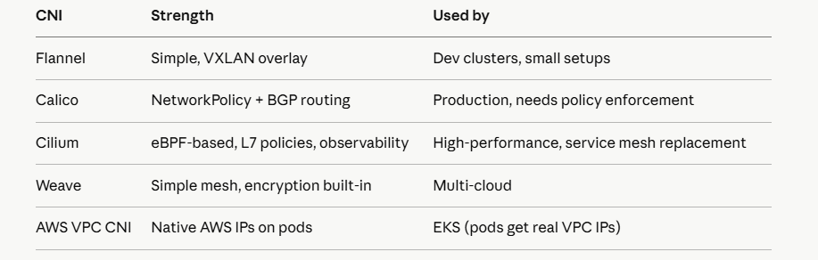

# Day 4 — Kubernetes Networking Mastery

## Part 1: The Kubernetes Networking Model
Four rules that govern everything in K8s networking. Memorize these:

- Every Pod gets its own IP address
- Pods on any node can talk to any other Pod without NAT
- Nodes can talk to all Pods without NAT
- The IP a Pod sees itself as is the same IP others use to reach it

This flat network model is enforced by the CNI plugin — not Kubernetes itself. K8s just defines the contract; CNI implements it.

## Part 2: CNI — Container Network Interface
When kubelet creates a Pod, it calls the CNI plugin to wire up networking. The CNI plugin does three things: assigns an IP, creates a virtual network interface inside the pod, and sets up routing rules on the node.
Popular CNI plugins and when to use each:



**Interview tip** : On EKS with AWS VPC CNI, each pod gets a real VPC IP address. That means pods are directly routable in your VPC — no overlay network overhead. But it also means you can exhaust VPC IPs if you over-provision pods.

## Part 3: Services — The Four Types
A Service gives a stable IP + DNS to a dynamic set of Pods. Pods come and go — Service IP never changes.
**ClusterIP (default)**
Internal only. Reachable within the cluster.


```
apiVersion: v1
kind: Service
metadata:
  name: url-shortener-svc
spec:
  type: ClusterIP           # default — omit type and you get this
  selector:
    app: url-shortener      # routes to pods with this label
  ports:
  - port: 80                # service port (what clients hit)
    targetPort: 8000        # pod port (where your app listens)
    protocol: TCP
```

```
# DNS name inside cluster: url-shortener-svc.default.svc.cluster.local
# Short form within same namespace: url-shortener-svc
curl http://url-shortener-svc/shorten
```

**NodePort**
Exposes service on every node's IP at a static port (30000–32767).

```
spec:
  type: NodePort
  selector:
    app: url-shortener
  ports:
  - port: 80
    targetPort: 8000
    nodePort: 30080          # optional — K8s assigns one if omitted
```

Reach it at <any-node-ip>:30080. Rarely used in production — LoadBalancer or Ingress is better.

**LoadBalancer**

Provisions a cloud load balancer (AWS ELB, GCP LB) automatically.

```
spec:
  type: LoadBalancer
  selector:
    app: url-shortener
  ports:
  - port: 80
    targetPort: 8000
```

**Cost trap**: Every LoadBalancer Service creates a separate cloud LB. Ten services = ten LBs = expensive. Use Ingress instead to share one LB across all services.

**ExternalName**
Maps a Service to an external DNS name. No proxying — just CNAME.

```
spec:
  type: ExternalName
  externalName: my-database.rds.amazonaws.com
```

Now your pods can use db-service as a hostname internally, and you swap the RDS endpoint without touching app config.

## Part 4: How kube-proxy Actually Works
When you create a Service, kube-proxy on every node writes iptables rules (or IPVS rules) that intercept traffic to the ClusterIP and DNAT it to one of the backing pod IPs.

```
# See the iptables rules kube-proxy creates
sudo iptables -t nat -L KUBE-SERVICES -n --line-numbers

# See endpoints backing a service (which pod IPs it routes to)
kubectl get endpoints url-shortener-svc

# When a pod passes readinessProbe, it's ADDED to Endpoints
# When it fails, it's REMOVED — that's how Services avoid sending to broken pods
kubectl describe endpoints url-shortener-svc
```

This is why **readinessProbe** is so critical — it's the mechanism that gates endpoint registration.

**Part 5: Ingress**
One Ingress controller (one cloud LB) routes to many services by hostname or path. This is how you avoid paying for 10 separate LoadBalancers.

```
apiVersion: networking.k8s.io/v1
kind: Ingress
metadata:
  name: url-shortener-ingress
  annotations:
    nginx.ingress.kubernetes.io/rewrite-target: /
    nginx.ingress.kubernetes.io/ssl-redirect: "true"
spec:
  ingressClassName: nginx
  tls:
  - hosts:
    - short.yourdomain.com
    secretName: tls-secret        # cert-manager fills this
  rules:
  - host: short.yourdomain.com
    http:
      paths:
      - path: /api
        pathType: Prefix
        backend:
          service:
            name: url-shortener-svc
            port:
              number: 80
      - path: /admin
        pathType: Prefix
        backend:
          service:
            name: admin-svc
            port:
              number: 80
  - host: metrics.yourdomain.com   # second hostname, same Ingress
    http:
      paths:
      - path: /
        pathType: Prefix
        backend:
          service:
            name: grafana-svc
            port:
              number: 3000
```

```
# Install ingress-nginx on kind
kubectl apply -f https://raw.githubusercontent.com/kubernetes/ingress-nginx/main/deploy/static/provider/kind/deploy.yaml

# Watch it come up
kubectl wait --namespace ingress-nginx \
  --for=condition=ready pod \
  --selector=app.kubernetes.io/component=controller \
  --timeout=90s

# Check ingress status — see ADDRESS field populate
kubectl get ingress
```

## Part 6: NetworkPolicy — Zero-Trust Networking
By default, all pods can talk to all pods. NetworkPolicy changes that. Think of it as a firewall for pod-to-pod traffic — enforced by the CNI plugin (Calico, Cilium — NOT Flannel).

**Default deny all (start here in production)**

```
apiVersion: networking.k8s.io/v1
kind: NetworkPolicy
metadata:
  name: default-deny-all
  namespace: production
spec:
  podSelector: {}           # empty = selects ALL pods in namespace
  policyTypes:
  - Ingress
  - Egress
```
**Allow only specific traffic**

```
apiVersion: networking.k8s.io/v1
kind: NetworkPolicy
metadata:
  name: url-shortener-netpol
  namespace: production
spec:
  podSelector:
    matchLabels:
      app: url-shortener    # this policy applies to url-shortener pods
  policyTypes:
  - Ingress
  - Egress
  ingress:
  - from:
    - podSelector:
        matchLabels:
          app: nginx-ingress  # only ingress controller can reach us
    ports:
    - protocol: TCP
      port: 8000
  egress:
  - to:
    - podSelector:
        matchLabels:
          app: redis          # we can only talk to redis
    ports:
    - protocol: TCP
      port: 6379
  - to:                       # allow DNS — always include this or DNS breaks
    - namespaceSelector: {}
    ports:
    - protocol: UDP
      port: 53
```

**Classic exam trap**: You write a NetworkPolicy but forget the DNS egress rule on port 53. Your app can't resolve any hostnames and appears broken even though the policy looks right. Always allow UDP 53 egress.

**Allow cross-namespace traffic**

```
ingress:
- from:
  - namespaceSelector:
      matchLabels:
        kubernetes.io/metadata.name: monitoring   # from monitoring namespace
    podSelector:
      matchLabels:
        app: prometheus                            # only prometheus pods
```

Note: namespaceSelector + podSelector in the same -from block means AND. Separate -from items mean OR.

## Part 7: DNS Inside Kubernetes
CoreDNS runs as a Deployment in kube-system and handles all cluster DNS. Every pod gets /etc/resolv.conf pointing to the CoreDNS ClusterIP.

```
# Full DNS name format:
# <service>.<namespace>.svc.<cluster-domain>
# Default cluster domain: cluster.local

# These all resolve inside the cluster:
# url-shortener-svc                          (same namespace)
# url-shortener-svc.default                 (cross-namespace short)
# url-shortener-svc.default.svc.cluster.local  (fully qualified)

# Debug DNS from inside a pod
kubectl run dns-debug --image=busybox:1.35 --rm -it -- sh
  nslookup url-shortener-svc
  nslookup url-shortener-svc.default.svc.cluster.local
  cat /etc/resolv.conf

# Check CoreDNS logs
kubectl logs -n kube-system -l k8s-app=kube-dns
```

## Part 8: Hands-On Exercises
**Exercise 1: Service types in action**

```
# Deploy the app
kubectl create deployment url-shortener --image=nginx:1.25 --replicas=2
kubectl expose deployment url-shortener --port=80 --target-port=80

# See the ClusterIP assigned
kubectl get svc url-shortener

# Prove it routes — call service from another pod
kubectl run test-pod --image=busybox:1.35 --rm -it -- wget -O- url-shortener

# See which pods are in the endpoints
kubectl get endpoints url-shortener

# Scale down to 0 — endpoints should empty
kubectl scale deployment url-shortener --replicas=0
kubectl get endpoints url-shortener   # should show <none>

# Scale back up
kubectl scale deployment url-shortener --replicas=2
kubectl get endpoints url-shortener   # pods reappear
```

**Exercise 2: NetworkPolicy enforcement**

```
# Need Calico for NetworkPolicy — install on kind
kubectl apply -f https://raw.githubusercontent.com/projectcalico/calico/v3.27.0/manifests/calico.yaml

# Deploy two apps
kubectl run app-a --image=nginx:1.25 --labels=app=app-a
kubectl run app-b --image=nginx:1.25 --labels=app=app-b
kubectl expose pod app-a --port=80
kubectl expose pod app-b --port=80

# Prove open comms (baseline)
kubectl exec app-b -- wget -qO- http://app-a   # should work

# Apply default-deny
cat <<EOF | kubectl apply -f -
apiVersion: networking.k8s.io/v1
kind: NetworkPolicy
metadata:
  name: deny-all
spec:
  podSelector: {}
  policyTypes: [Ingress, Egress]
EOF

# Now it should fail
kubectl exec app-b -- wget -qO- --timeout=3 http://app-a   # should hang/fail

# Allow app-b → app-a specifically
cat <<EOF | kubectl apply -f -
apiVersion: networking.k8s.io/v1
kind: NetworkPolicy
metadata:
  name: allow-b-to-a
spec:
  podSelector:
    matchLabels:
      app: app-a
  policyTypes: [Ingress]
  ingress:
  - from:
    - podSelector:
        matchLabels:
          app: app-b
    ports:
    - port: 80
EOF

# Now it should work again
kubectl exec app-b -- wget -qO- http://app-a
```

**Exercise 3: Ingress with path routing**

```
# Two backends
kubectl create deployment backend-api --image=nginx:1.25
kubectl create deployment backend-web --image=httpd:2.4
kubectl expose deployment backend-api --port=80
kubectl expose deployment backend-web --port=80

cat <<EOF | kubectl apply -f -
apiVersion: networking.k8s.io/v1
kind: Ingress
metadata:
  name: path-routing
  annotations:
    nginx.ingress.kubernetes.io/rewrite-target: /
spec:
  ingressClassName: nginx
  rules:
  - host: localhost
    http:
      paths:
      - path: /api
        pathType: Prefix
        backend:
          service:
            name: backend-api
            port:
              number: 80
      - path: /web
        pathType: Prefix
        backend:
          service:
            name: backend-web
            port:
              number: 80
EOF

# Test routing (kind forwards port 80 to ingress)
curl http://localhost/api
curl http://localhost/web
```

## Part 9: Interview Questions — Day 4
**Q1: A pod can reach google.com but can't reach another pod by service name. What do you check?**

CoreDNS. Exec into the pod, check /etc/resolv.conf points to CoreDNS ClusterIP. Run nslookup <service-name>. Check kubectl logs -n kube-system -l k8s-app=kube-dns for errors. Also verify the Service selector matches the pod labels — a typo means zero endpoints.

**Q2: What is a headless Service and when do you use it?**

clusterIP: None — no virtual IP is assigned. DNS returns individual pod IPs instead of a single ClusterIP. Used with StatefulSets so each pod gets a stable DNS name (redis-0.redis-headless...). Also used for service discovery when clients want to connect directly to specific pods.

**Q3: A NetworkPolicy is applied but traffic still flows. Why?**

The CNI plugin doesn't support NetworkPolicy. Flannel ignores NetworkPolicy — you need Calico, Cilium, or Weave. Check which CNI is running: kubectl get pods -n kube-system | grep -E 'calico|cilium|flannel|weave'.

**Q4: What's the difference between pathType: Prefix and pathType: Exact?**

Exact matches only that precise path. Prefix matches the path and anything under it — /api matches /api, /api/users, /api/v2/.... Also ImplementationSpecific defers to the Ingress controller's own rules.

**Q5: How does a Service know which pods to route to?**

Label selector. The Service's selector field matches pod labels. kube-proxy watches the Endpoints object, which the Endpoints controller updates whenever pods matching the selector are added/removed or pass/fail readinessProbe. Traffic only goes to Ready pods.

**Q6: You have 10 microservices. Should you create 10 LoadBalancer Services or one Ingress?**

One Ingress. Each LoadBalancer Service creates a separate cloud load balancer — expensive and hard to manage. An Ingress uses one LB and routes based on hostname/path to all services. Exception: if a service needs non-HTTP (TCP/UDP) traffic, you still need a LoadBalancer or NodePort for that specific service.
