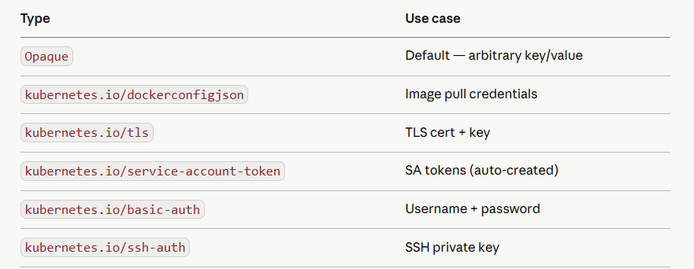
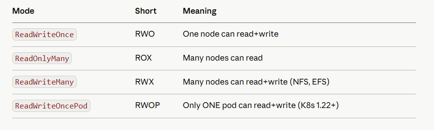
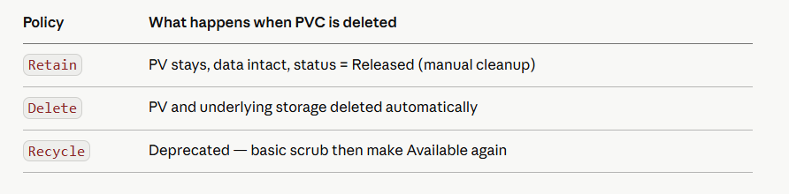
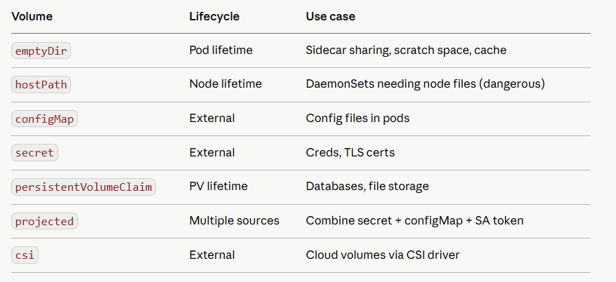

# Day 5 — Config, Secrets & Storage
If Day 4 was about networking, Day 5 is about data — how your apps get configuration and how they persist state. Heavy CKAD + CKA exam weight on all of this.

## Part 1: ConfigMaps
ConfigMaps decouple configuration from your container image. Same image, different config per environment.

**Three ways to create*

```
# From literal values
kubectl create configmap app-config \
  --from-literal=APP_ENV=production \
  --from-literal=LOG_LEVEL=info \
  --from-literal=MAX_CONNECTIONS=100

# From a file (filename becomes the key)
echo "DEBUG=false" > app.env
kubectl create configmap app-config --from-file=app.env

# From a directory (each file becomes a key)
kubectl create configmap app-config --from-file=./config-dir/

# Inspect it
kubectl get configmap app-config -o yaml
```

**Three ways to consume*

```
apiVersion: v1
kind: Pod
spec:
  containers:
  - name: fastapi
    image: your-fastapi:latest

    # Method 1: individual env vars
    env:
    - name: APP_ENV
      valueFrom:
        configMapKeyRef:
          name: app-config
          key: APP_ENV

    # Method 2: all keys as env vars at once
    envFrom:
    - configMapRef:
        name: app-config

    # Method 3: mount as files (best for multi-line config)
    volumeMounts:
    - name: config-vol
      mountPath: /etc/config     # each key becomes a file here

  volumes:
  - name: config-vol
    configMap:
      name: app-config
```

**Key insight**: Env var injection **(env/envFrom)* is static — the app must restart to pick up changes. Volume-mounted ConfigMaps update automatically within ~60 seconds. For live config reloads, always use volume mounts.

## Part 2: Secrets
Secrets store sensitive data. Same API as ConfigMap but with two differences: values are base64-encoded, and etcd can encrypt them at rest.

**Secret types — know all of them*



```
# Opaque secret
kubectl create secret generic app-secrets \
  --from-literal=DB_PASSWORD=supersecret \
  --from-literal=API_KEY=abc123xyz

# TLS secret (cert-manager creates these automatically)
kubectl create secret tls my-tls \
  --cert=tls.crt \
  --key=tls.key

# Docker registry secret (for private image pulls)
kubectl create secret docker-registry ghcr-creds \
  --docker-server=ghcr.io \
  --docker-username=youruser \
  --docker-password=ghp_yourtoken

# Decode a secret value
kubectl get secret app-secrets -o jsonpath='{.data.DB_PASSWORD}' | base64 -d
```

**Consuming secrets — identical to ConfigMap**

```
containers:
- name: fastapi
  env:
  - name: DB_PASSWORD
    valueFrom:
      secretKeyRef:
        name: app-secrets
        key: DB_PASSWORD

  # Pull from private registry — attach to pod spec, not container
  imagePullSecrets:
  - name: ghcr-creds
```

**Encryption at rest — CKS exam topic**
By default etcd stores secrets as plain base64 — not encrypted. Enable encryption:

```
# /etc/kubernetes/enc/encryption-config.yaml on control plane
apiVersion: apiserver.config.k8s.io/v1
kind: EncryptionConfiguration
resources:
- resources:
  - secrets
  providers:
  - aescbc:                        # AES-CBC encryption
      keys:
      - name: key1
        secret: <base64-32-byte-key>
  - identity: {}                   # fallback: read unencrypted existing secrets
```

Then add to **kube-apiserver: --encryption-provider-config=/etc/kubernetes/enc/encryption-config.yaml*

**Interview tip**: base64 is NOT encryption. Anyone with etcd access can decode it trivially. Encryption at rest + RBAC on Secret resources + external secret managers (Vault, AWS Secrets Manager) is the production pattern.

## Part 3: Storage Architecture
Kubernetes separates storage into three layers. Understanding this separation is what CKA tests.

```
PersistentVolume (PV)      — the actual storage resource (admin creates)
PersistentVolumeClaim (PVC) — a request for storage (developer creates)  
StorageClass (SC)          — a template for dynamic PV provisioning
```

**Static provisioning: admin pre-creates PVs. Dynamic provisioning: StorageClass creates PVs on demand when a PVC is created. Production always uses dynamic.*

## Part 4: PersistentVolumes

```
apiVersion: v1
kind: PersistentVolume
metadata:
  name: postgres-pv
spec:
  capacity:
    storage: 10Gi
  accessModes:
  - ReadWriteOnce           # RWO: one node at a time (block storage)
  persistentVolumeReclaimPolicy: Retain   # don't delete data when PVC released
  storageClassName: manual
  hostPath:                 # for local dev only — never in production
    path: /data/postgres
```

**Access modes — exam critical**



**Reclaim policies**



## Part 5: PersistentVolumeClaims

```
apiVersion: v1
kind: PersistentVolumeClaim
metadata:
  name: postgres-pvc
spec:
  accessModes:
  - ReadWriteOnce
  resources:
    requests:
      storage: 5Gi
  storageClassName: manual    # must match PV storageClassName
```

K8s binds a PVC to a PV using: access mode match + storage size (PV >= PVC) + storageClassName match. A PVC stays **Pending* until a suitable PV exists.

```
# Check binding status
kubectl get pvc
# PHASE: Pending → Bound (once matched to a PV)

kubectl get pv
# STATUS: Available → Bound → Released → Failed
```

**Attach to a Pod:*

```
spec:
  containers:
  - name: postgres
    image: postgres:15
    volumeMounts:
    - name: pgdata
      mountPath: /var/lib/postgresql/data
  volumes:
  - name: pgdata
    persistentVolumeClaim:
      claimName: postgres-pvc     # reference the PVC by name
```

## Part 6: StorageClasses — Dynamic Provisioning
StorageClass is the production pattern. No pre-created PVs needed — they're created on demand.

```
apiVersion: storage.k8s.io/v1
kind: StorageClass
metadata:
  name: fast-ssd
  annotations:
    storageclass.kubernetes.io/is-default-class: "true"   # default SC
provisioner: kubernetes.io/aws-ebs           # the driver that creates volumes
parameters:
  type: gp3
  iops: "3000"
  throughput: "125"
  encrypted: "true"
reclaimPolicy: Delete
allowVolumeExpansion: true                   # allow resizing PVCs
volumeBindingMode: WaitForFirstConsumer      # don't provision until pod is scheduled
```

**With a StorageClass, just create a PVC and the PV appears automatically:*

```
apiVersion: v1
kind: PersistentVolumeClaim
metadata:
  name: app-data
spec:
  accessModes: [ReadWriteOnce]
  storageClassName: fast-ssd    # triggers dynamic provisioning
  resources:
    requests:
      storage: 20Gi
```

```
# See available storage classes
kubectl get storageclass

# See which is default (has the annotation)
kubectl get storageclass -o wide

# Resize a PVC (StorageClass must have allowVolumeExpansion: true)
kubectl patch pvc app-data -p '{"spec":{"resources":{"requests":{"storage":"40Gi"}}}}'
```

## Part 7: Volume Types Cheat Sheet



**Projected volume — powerful for CKS**

```
volumes:
- name: combined
  projected:
    sources:
    - configMap:
        name: app-config
    - secret:
        name: app-secrets
    - serviceAccountToken:        # inject SA token with custom audience
        audience: vault
        expirationSeconds: 3600
        path: token
```

## Part 8: Hands-On Exercises

**Exercise 1: ConfigMap live reload*

```
# Create a ConfigMap
kubectl create configmap live-config --from-literal=MESSAGE="hello v1"

# Pod that reads it as a file
cat <<EOF | kubectl apply -f -
apiVersion: v1
kind: Pod
metadata:
  name: config-reader
spec:
  containers:
  - name: reader
    image: busybox
    command: ["sh","-c","while true; do cat /etc/config/MESSAGE; sleep 5; done"]
    volumeMounts:
    - name: cfg
      mountPath: /etc/config
  volumes:
  - name: cfg
    configMap:
      name: live-config
EOF

# Watch logs
kubectl logs config-reader -f &

# Update the ConfigMap — watch logs update within ~60s without restart
kubectl create configmap live-config \
  --from-literal=MESSAGE="hello v2" \
  --dry-run=client -o yaml | kubectl apply -f -
```

**Exercise 2: Secret — create, consume, decode*

```
# Create secret
kubectl create secret generic db-creds \
  --from-literal=username=admin \
  --from-literal=password=S3cr3t!

# Consume as env vars
cat <<EOF | kubectl apply -f -
apiVersion: v1
kind: Pod
metadata:
  name: secret-test
spec:
  containers:
  - name: app
    image: busybox
    command: ["sh","-c","echo user=$DB_USER pass=$DB_PASS && sleep 3600"]
    env:
    - name: DB_USER
      valueFrom:
        secretKeyRef:
          name: db-creds
          key: username
    - name: DB_PASS
      valueFrom:
        secretKeyRef:
          name: db-creds
          key: password
EOF

kubectl logs secret-test
# user=admin pass=S3cr3t!

# Prove base64 is not encryption
kubectl get secret db-creds -o jsonpath='{.data.password}' | base64 -d
```

**Exercise 3: Full PV → PVC → Pod pipeline*

```
# Static PV
cat <<EOF | kubectl apply -f -
apiVersion: v1
kind: PersistentVolume
metadata:
  name: local-pv
spec:
  capacity:
    storage: 1Gi
  accessModes: [ReadWriteOnce]
  persistentVolumeReclaimPolicy: Retain
  storageClassName: manual
  hostPath:
    path: /tmp/k8s-data
---
apiVersion: v1
kind: PersistentVolumeClaim
metadata:
  name: local-pvc
spec:
  accessModes: [ReadWriteOnce]
  storageClassName: manual
  resources:
    requests:
      storage: 500Mi
---
apiVersion: v1
kind: Pod
metadata:
  name: storage-test
spec:
  containers:
  - name: writer
    image: busybox
    command: ["sh","-c","echo 'data written' > /data/test.txt && sleep 3600"]
    volumeMounts:
    - name: storage
      mountPath: /data
  volumes:
  - name: storage
    persistentVolumeClaim:
      claimName: local-pvc
EOF

# Verify PVC bound
kubectl get pvc local-pvc
# STATUS should be Bound

# Check data was written
kubectl exec storage-test -- cat /data/test.txt

# Delete pod — data persists on PV
kubectl delete pod storage-test

# New pod reads the same data
cat <<EOF | kubectl apply -f -
apiVersion: v1
kind: Pod
metadata:
  name: storage-reader
spec:
  containers:
  - name: reader
    image: busybox
    command: ["sh","-c","cat /data/test.txt && sleep 3600"]
    volumeMounts:
    - name: storage
      mountPath: /data
  volumes:
  - name: storage
    persistentVolumeClaim:
      claimName: local-pvc
EOF

kubectl logs storage-reader
# data written  ← survived pod deletion
```

**Exercise 4: StatefulSet with volumeClaimTemplates (production pattern)*

```
cat <<EOF | kubectl apply -f -
apiVersion: v1
kind: Service
metadata:
  name: postgres-headless
spec:
  clusterIP: None
  selector: {app: postgres}
  ports:
  - port: 5432
---
apiVersion: apps/v1
kind: StatefulSet
metadata:
  name: postgres
spec:
  serviceName: postgres-headless
  replicas: 1
  selector:
    matchLabels:
      app: postgres
  template:
    metadata:
      labels:
        app: postgres
    spec:
      containers:
      - name: postgres
        image: postgres:15-alpine
        env:
        - name: POSTGRES_PASSWORD
          valueFrom:
            secretKeyRef:
              name: db-creds
              key: password
        - name: POSTGRES_USER
          valueFrom:
            secretKeyRef:
              name: db-creds
              key: username
        volumeMounts:
        - name: pgdata
          mountPath: /var/lib/postgresql/data
  volumeClaimTemplates:
  - metadata:
      name: pgdata
    spec:
      accessModes: [ReadWriteOnce]
      resources:
        requests:
          storage: 1Gi
EOF

# Each StatefulSet pod gets its own auto-created PVC
kubectl get pvc
# pgdata-postgres-0 → Bound

# Prove data persists across pod restart
kubectl exec postgres-0 -- psql -U admin -c "CREATE TABLE test (id serial);"
kubectl delete pod postgres-0
kubectl get pod -w   # postgres-0 restarts
kubectl exec postgres-0 -- psql -U admin -c "\dt"   # table still exists
```

## Part 9: Interview Questions — Day 5

**Q1: What's the difference between a ConfigMap and a Secret?*

Both are key-value stores in etcd. Secrets are base64-encoded and can have encryption at rest enabled via EncryptionConfiguration. ConfigMaps are plain text. Secrets also have typed subtypes (tls, dockerconfigjson, etc.) that Kubernetes understands natively. In practice the main difference is intent — Secrets signal sensitive data and can be locked down via RBAC independently.

**Q2: A pod shows Pending with event "no persistent volumes available for this claim". What do you do?**

Three checks: does a PV exist with matching storageClassName? Does the PV have enough capacity (PV >= PVC request)? Does the access mode match? If using dynamic provisioning, check if the StorageClass exists and the provisioner pod is running. Fix whichever check fails.

**Q3: What happens to a PV when its PVC is deleted, with reclaimPolicy: Retain?*

The PV moves to Released state. The data is safe but the PV is not automatically available for new claims — it still has the old claim reference. An admin must manually edit or delete the PV to make it Available again. With Delete policy, both PV and underlying storage are deleted automatically.

**Q4: Why use volumeBindingMode: WaitForFirstConsumer?**

With the default Immediate mode, the PV is provisioned the moment a PVC is created — in a specific availability zone. If the pod then gets scheduled to a different AZ, it can't mount the volume. WaitForFirstConsumer delays provisioning until the pod is scheduled, so the volume is created in the same AZ as the pod.

**Q5: Can two pods on different nodes mount the same PVC?*

Only if the access mode is ReadWriteMany (RWX) — supported by NFS, AWS EFS, Azure Files. Block storage like AWS EBS only supports ReadWriteOnce (RWO) — one node at a time. Trying to mount an RWO volume from a second node will leave the second pod in ContainerCreating state.

**Q6: How do you pass a secret to a pod without it appearing in the pod spec YAML?**

Use secretKeyRef or envFrom: secretRef — these reference the Secret by name, the actual value never appears in the pod spec. For even tighter security: mount as a volume (secret never in env vars, which can leak via /proc), use short-lived projected tokens, or use an external secrets operator (External Secrets Operator + AWS Secrets Manager) so the secret never even lives in etcd.