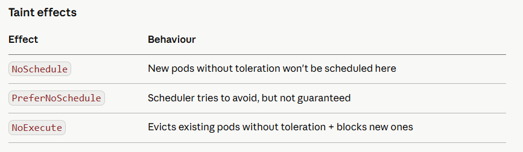

# Day 7 — Cluster Setup & Lifecycle

Week 2 starts now. We shift from **developer** (CKAD) to **administrator** (CKA). Same cluster, completely different lens — you're now responsible for the infrastructure itself, not just the workloads running on it.

## Part 1: The CKA Mindset Shift
CKAD = "my app runs correctly on Kubernetes"

CKA = "Kubernetes itself runs correctly, and I can fix it when it doesn't"
CKA tests you on things developers never touch: bootstrapping clusters from scratch, upgrading control plane components, managing node lifecycle, and recovering from failures. This week is where the high-paying SRE/Platform Engineer jobs live.

## Part 2: How kubeadm Bootstraps a Cluster
****kubeadm* is the official tool to bootstrap a production-grade cluster. Understanding what it does under the hood is pure CKA exam material.

**What kubeadm init does — step by step**

```
1. Preflight checks        — kernel params, ports, Docker/containerd running
2. Generates PKI           — CA cert + keys for all components in /etc/kubernetes/pki/
3. Writes kubeconfig files — admin.conf, controller-manager.conf, scheduler.conf
4. Generates static pod manifests — API server, controller-manager, scheduler, etcd written to /etc/kubernetes/manifests/
5. Waits for control plane — kubelet reads manifests, starts static pods
6. Uploads config          — stores kubeadm config as ConfigMap in kube-system
7. Marks control-plane     — taints the node NoSchedule
8. Installs CoreDNS        — DNS addon as Deployment
9. Installs kube-proxy     — as DaemonSet
10. Prints join command    — with bootstrap token for workers to join
```

**Key insight**: The control plane (API server, etcd, scheduler, controller-manager) runs as **static pods* — YAML files in **/etc/kubernetes/manifests/*. kubelet watches that directory and starts/restarts them directly, without talking to the API server. This is how the cluster can boot itself.

```
# See the static pod manifests on your control plane node
docker exec -it k8s-mastery-control-plane ls /etc/kubernetes/manifests/
# kube-apiserver.yaml  kube-controller-manager.yaml  kube-scheduler.yaml  etcd.yaml

# Read the API server manifest — all its flags are here
docker exec -it k8s-mastery-control-plane \
  cat /etc/kubernetes/manifests/kube-apiserver.yaml

# See where all the certs live
docker exec -it k8s-mastery-control-plane ls /etc/kubernetes/pki/
```

## Part 3: kubeadm in Practice

**Full cluster bootstrap (what you'd do on real VMs)**

```
# On the control-plane node
kubeadm init \
  --pod-network-cidr=192.168.0.0/16 \      # must match your CNI (Calico default)
  --kubernetes-version=1.30.0 \
  --control-plane-endpoint=my-cluster.example.com \  # HA: VIP or load balancer
  --upload-certs                            # for HA multi-master setup

# After init — set up kubeconfig for kubectl
mkdir -p $HOME/.kube
cp /etc/kubernetes/admin.conf $HOME/.kube/config
chown $(id -u):$(id -g) $HOME/.kube/config

# Install CNI (Calico)
kubectl apply -f https://raw.githubusercontent.com/projectcalico/calico/v3.27.0/manifests/calico.yaml

# Generate join command for workers
kubeadm token create --print-join-command

# On each worker node — run the printed join command
kubeadm join my-cluster.example.com:6443 \
  --token <token> \
  --discovery-token-ca-cert-hash sha256:<hash>
```

**Verify cluster health after bootstrap**

```
kubectl get nodes
kubectl get pods -n kube-system
kubectl cluster-info

# Check component status (still tested in CKA despite deprecation)
kubectl get componentstatuses

# Verify etcd is healthy
kubectl exec -n kube-system etcd-k8s-mastery-control-plane -- \
  etcdctl \
  --endpoints=https://127.0.0.1:2379 \
  --cacert=/etc/kubernetes/pki/etcd/ca.crt \
  --cert=/etc/kubernetes/pki/etcd/server.crt \
  --key=/etc/kubernetes/pki/etcd/server.key \
  endpoint health
```

## Part 4: Cluster Upgrade — The CKA Showstopper
Upgrading a cluster is one of the most tested CKA tasks. The order is strict and non-negotiable:

```
1. Upgrade control plane node first (kubeadm, then kubelet, then kubectl)
2. Upgrade worker nodes one at a time (drain → upgrade → uncordon)
3. Never skip minor versions (1.28 → 1.29 → 1.30, never 1.28 → 1.30)
```

**Step 1: Upgrade control plane**

```
# On the control plane node
# First — check what versions are available
apt-cache madison kubeadm | head -5

# Unhold, upgrade kubeadm, rehold
apt-mark unhold kubeadm
apt-get install -y kubeadm=1.30.0-1.1
apt-mark hold kubeadm

# Verify the new kubeadm
kubeadm version

# See the upgrade plan — shows what will change
kubeadm upgrade plan

# Apply the upgrade (upgrades API server, scheduler, controller-manager, etcd)
kubeadm upgrade apply v1.30.0

# Now upgrade kubelet and kubectl on control plane
apt-mark unhold kubelet kubectl
apt-get install -y kubelet=1.30.0-1.1 kubectl=1.30.0-1.1
apt-mark hold kubelet kubectl

# Restart kubelet
systemctl daemon-reload
systemctl restart kubelet

# Verify control plane is upgraded
kubectl get nodes
# control-plane shows v1.30.0, workers still on v1.29.x — that's expected
```

**Step 2: Upgrade each worker node**

```
# From control plane — drain the worker (evicts pods, marks unschedulable)
kubectl drain worker-node-1 \
  --ignore-daemonsets \       # DaemonSet pods can't be evicted — that's fine
  --delete-emptydir-data      # evict pods using emptyDir volumes

# On the worker node itself
apt-mark unhold kubeadm kubelet kubectl
apt-get install -y kubeadm=1.30.0-1.1 kubelet=1.30.0-1.1 kubectl=1.30.0-1.1
apt-mark hold kubeadm kubelet kubectl

kubeadm upgrade node          # upgrades worker node config (not control plane)

systemctl daemon-reload
systemctl restart kubelet

# Back on control plane — uncordon the worker (makes it schedulable again)
kubectl uncordon worker-node-1

# Verify
kubectl get nodes             # worker-node-1 now shows v1.30.0
```

## Part 5: Node Management

**Cordon — mark unschedulable but don't evict**

```
# No new pods scheduled here, existing pods keep running
kubectl cordon worker-node-1

# Reverse it
kubectl uncordon worker-node-1
```

**Drain — evict everything, then cordon**

```
# Safely empty a node for maintenance
kubectl drain worker-node-1 \
  --ignore-daemonsets \
  --delete-emptydir-data \
  --grace-period=30           # give pods 30s to shut down gracefully

# Check nothing is left (except DaemonSets)
kubectl get pods -o wide | grep worker-node-1
```

**Node conditions — what CKA tests**

```
# See node conditions
kubectl describe node worker-node-1 | grep -A 20 Conditions

# Common conditions and what they mean:
# Ready=True          node is healthy
# Ready=False         kubelet can't reach API server, or node is broken
# MemoryPressure=True node is low on RAM — eviction may start
# DiskPressure=True   node is low on disk
# PIDPressure=True    too many processes on node
# NetworkUnavailable  CNI not configured correctly
```

## Part 6: Taints and Tolerations
Taints repel pods from nodes. Tolerations let pods bypass taints. Together they control which workloads land on which nodes.

**Taint effects**



```
# Taint a node — mark it for GPU workloads only
kubectl taint nodes worker-node-2 dedicated=gpu:NoSchedule

# Remove a taint (note the trailing minus)
kubectl taint nodes worker-node-2 dedicated=gpu:NoSchedule-

# View taints on a node
kubectl describe node worker-node-2 | grep Taints
```

**Tolerate the taint in your pod spec:**

```
spec:
  tolerations:
  - key: dedicated
    operator: Equal
    value: gpu
    effect: NoSchedule

  # Tolerate control-plane taint (runs pods on master)
  - key: node-role.kubernetes.io/control-plane
    operator: Exists
    effect: NoSchedule
```

**Node affinity vs taints — know the difference**
Taints/tolerations = **push** mechanism (nodes repel pods).

Node affinity = **pull** mechanism (pods are attracted to nodes).

```
spec:
  affinity:
    nodeAffinity:
      requiredDuringSchedulingIgnoredDuringExecution:   # hard rule
        nodeSelectorTerms:
        - matchExpressions:
          - key: kubernetes.io/arch
            operator: In
            values: [amd64]
      preferredDuringSchedulingIgnoredDuringExecution:  # soft rule
      - weight: 80
        preference:
          matchExpressions:
          - key: zone
            operator: In
            values: [us-east-1a]
```

## Part 7: Resource Quotas and LimitRanges

**ResourceQuota — namespace-level ceiling**

```
apiVersion: v1
kind: ResourceQuota
metadata:
  name: production-quota
  namespace: production
spec:
  hard:
    requests.cpu: "10"            # total CPU requests in namespace
    requests.memory: 20Gi
    limits.cpu: "20"
    limits.memory: 40Gi
    pods: "50"                    # max pods
    services: "10"
    persistentvolumeclaims: "20"
    secrets: "30"
    configmaps: "30"
```

```
kubectl create quota production-quota \
  --hard=pods=50,requests.cpu=10,requests.memory=20Gi \
  -n production

# Check current usage vs quota
kubectl describe resourcequota -n production
```

**LimitRange — per-pod/container defaults and bounds**

```
apiVersion: v1
kind: LimitRange
metadata:
  name: container-limits
  namespace: production
spec:
  limits:
  - type: Container
    default:              # injected if container has no limits
      cpu: 500m
      memory: 256Mi
    defaultRequest:       # injected if container has no requests
      cpu: 100m
      memory: 128Mi
    max:                  # container cannot exceed this
      cpu: "2"
      memory: 1Gi
    min:                  # container cannot go below this
      cpu: 50m
      memory: 32Mi
  - type: PersistentVolumeClaim
    max:
      storage: 50Gi
    min:
      storage: 1Gi
```

**Interview insight**: ResourceQuota + LimitRange together is the standard multi-tenancy pattern. Quota limits total namespace consumption. LimitRange ensures every pod has sane defaults so quota accounting works even when developers forget to set requests/limits.

## Part 8: Hands-On Exercises

**Exercise 1: Simulate node drain + upgrade cycle on kind**

```
# See your nodes
kubectl get nodes

# Cordon a worker — no new pods here
kubectl cordon k8s-mastery-worker

# Deploy something to see it avoid the cordoned node
kubectl create deployment test-drain --image=nginx:1.25 --replicas=4
kubectl get pods -o wide   # all pods on the other worker or control-plane

# Drain the worker
kubectl drain k8s-mastery-worker \
  --ignore-daemonsets \
  --delete-emptydir-data

# Verify node is empty of non-daemonset pods
kubectl get pods -o wide

# Simulate upgrade complete — uncordon
kubectl uncordon k8s-mastery-worker
kubectl get pods -o wide   # scheduler rebalances
```

**Exercise 2: Taints and tolerations**

```
# Taint a worker node
kubectl taint nodes k8s-mastery-worker special=true:NoSchedule

# Deploy without toleration — should NOT land on tainted node
kubectl create deployment no-toleration --image=nginx:1.25 --replicas=4
kubectl get pods -o wide   # all on other node

# Deploy WITH toleration
cat <<EOF | kubectl apply -f -
apiVersion: apps/v1
kind: Deployment
metadata:
  name: with-toleration
spec:
  replicas: 4
  selector:
    matchLabels:
      app: with-toleration
  template:
    metadata:
      labels:
        app: with-toleration
    spec:
      tolerations:
      - key: special
        operator: Equal
        value: "true"
        effect: NoSchedule
      containers:
      - name: nginx
        image: nginx:1.25
EOF

kubectl get pods -o wide   # spreads across both nodes

# Cleanup taint
kubectl taint nodes k8s-mastery-worker special=true:NoSchedule-
```

**Exercise 3: ResourceQuota enforcement**

```
kubectl create namespace quota-test

kubectl create quota test-quota \
  --hard=pods=3,requests.cpu=500m,requests.memory=512Mi \
  -n quota-test

# Try to create 4 pods — 4th should be rejected
for i in 1 2 3 4; do
  kubectl run pod-$i --image=nginx:1.25 \
    --requests=cpu=100m,memory=128Mi \
    -n quota-test
done
# pod-4 fails: exceeded quota

kubectl describe resourcequota -n quota-test
```

**Exercise 4: LimitRange default injection**

```
kubectl create namespace limitrange-test

cat <<EOF | kubectl apply -f -
apiVersion: v1
kind: LimitRange
metadata:
  name: default-limits
  namespace: limitrange-test
spec:
  limits:
  - type: Container
    default:
      cpu: 300m
      memory: 256Mi
    defaultRequest:
      cpu: 100m
      memory: 128Mi
EOF

# Create pod with NO resource spec
kubectl run no-resources --image=nginx:1.25 -n limitrange-test

# See that LimitRange injected defaults automatically
kubectl get pod no-resources -n limitrange-test \
  -o jsonpath='{.spec.containers[0].resources}' | jq .
```

**Exercise 5: Static pod manipulation (CKA favourite)**

```
# On kind, exec into the control plane node
docker exec -it k8s-mastery-control-plane bash

# See static pod manifests
ls /etc/kubernetes/manifests/

# Create a custom static pod — kubelet starts it automatically
cat <<EOF > /etc/kubernetes/manifests/my-static-pod.yaml
apiVersion: v1
kind: Pod
metadata:
  name: my-static-pod
  namespace: default
spec:
  containers:
  - name: nginx
    image: nginx:1.25
EOF

exit

# Back on your machine — static pod appears automatically
kubectl get pods   # my-static-pod-k8s-mastery-control-plane appears

# Delete it by removing the manifest (kubectl delete doesn't work permanently)
docker exec k8s-mastery-control-plane \
  rm /etc/kubernetes/manifests/my-static-pod.yaml

kubectl get pods   # gone within seconds
```

## Part 9: Interview Questions — Day 8

**Q1: What is a static pod and how is it different from a regular pod?**

A static pod is defined by a YAML file in /etc/kubernetes/manifests/ on a node. kubelet manages it directly — no ReplicaSet, no Deployment, no API server involved in its creation. The API server sees it as a mirror object (read-only). The control plane components (API server, etcd, scheduler, controller-manager) are all static pods. You can't kubectl delete them permanently — you must remove the manifest file.

**Q2: A worker node shows NotReady. Walk me through your diagnosis.**

SSH to the node. Check systemctl status kubelet — is it running? Check journalctl -u kubelet -n 50 for errors. Common causes: kubelet crashed (restart it), CNI plugin broken (check CNI pods in kube-system), disk/memory pressure (check df -h and free -m), certificate expired (check kubelet cert dates), node network issue (can it reach the API server IP?).

**Q3: Why must you upgrade the control plane before workers?**

The API server must be at the target version before workers join at that version. The K8s compatibility guarantee is: API server can be one minor version ahead of kubelet, but never behind. So upgrading workers before control plane would mean the API server is talking to kubelets that are newer — unsupported. Control plane first is always the rule.

**Q4: What's the difference between kubectl drain and kubectl cordon?**

Cordon marks a node unschedulable — no new pods land there, existing pods keep running. Drain does cordon plus evicts all existing pods (respecting PodDisruptionBudgets and grace periods). Use cordon when you want to stop new scheduling temporarily. Use drain before node maintenance or shutdown.

**Q5: A namespace has a ResourceQuota requiring CPU requests, but a pod was created without any. What happens?**

The pod is rejected by the API server with a quota error. Once a ResourceQuota defines requests.cpu, every pod in that namespace must explicitly set requests.cpu — there's no implicit default. This is why LimitRange and ResourceQuota are deployed together: LimitRange injects defaults so pods satisfy the quota requirement automatically.

**Q6: How do you run a pod on the control plane node?**

The control plane has a taint node-role.kubernetes.io/control-plane:NoSchedule. Add a matching toleration to the pod spec with operator: Exists and effect: NoSchedule. Or combine with a nodeSelector/nodeAffinity targeting the control-plane node label.