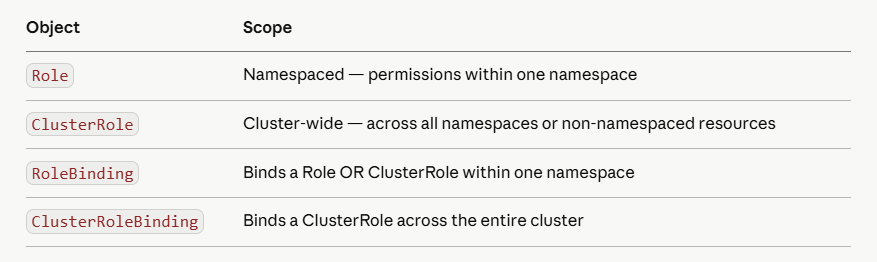
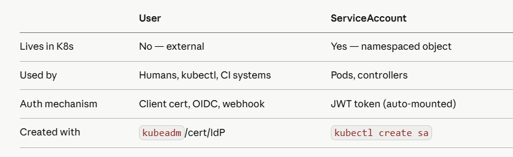
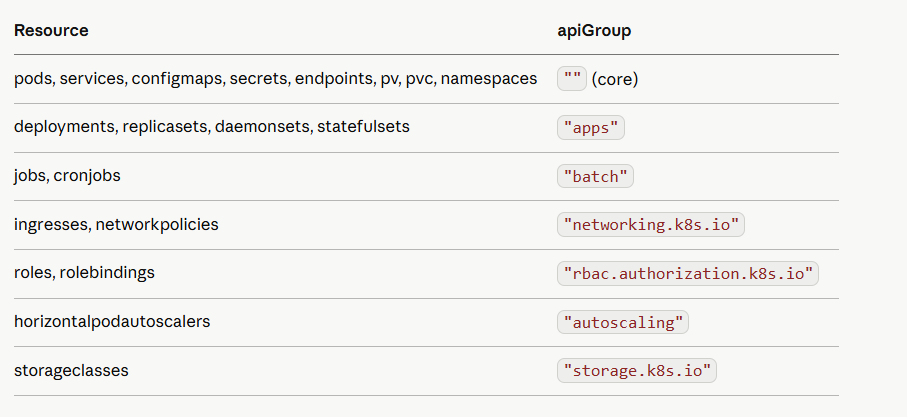

# Day 8 — RBAC & ServiceAccounts

RBAC is the #1 security topic in both CKA and CKS. Every production K8s cluster lives or dies by its RBAC model. Get this wrong and you either lock out your own engineers or give attackers cluster-admin. Today you build it right.

## Part 1: RBAC Mental Model
Four objects. That's all RBAC is. Internalize this hierarchy:

```
WHO can do WHAT on WHICH resources
 │              │         │
 │              │         └── Resources (pods, secrets, deployments...)
 │              └──────────── Verbs (get, list, watch, create, update, patch, delete)
 └─────────────────────────── Subject (User, Group, ServiceAccount)

Role / ClusterRole        — defines WHAT on WHICH
RoleBinding / ClusterRoleBinding — binds WHO to the role
```

**Two scope levels:*



**The subtle power move**: A **ClusterRole* bound with a **RoleBinding* (not ClusterRoleBinding) gives those permissions only within that namespace. This lets you define a role once and reuse it across namespaces — don't redefine the same Role in every namespace.

## Part 2: Users vs ServiceAccounts
Kubernetes has no built-in user object. Users are external — authenticated via certificates, OIDC tokens, or webhook. ServiceAccounts are internal K8s objects used by pods.



## Part 3: Roles and ClusterRoles

```
# Imperative — fastest in exam
kubectl create role pod-reader \
  --verb=get,list,watch \
  --resource=pods \
  -n development

kubectl create clusterrole secret-reader \
  --verb=get,list \
  --resource=secrets

# Check what you created
kubectl describe role pod-reader -n development
kubectl describe clusterrole secret-reader
```

**Declarative — know the YAML structure cold:*

```
apiVersion: rbac.authorization.k8s.io/v1
kind: Role
metadata:
  name: pod-manager
  namespace: development
rules:
- apiGroups: [""]               # "" = core API group (pods, services, configmaps)
  resources: ["pods"]
  verbs: ["get","list","watch","create","update","patch","delete"]

- apiGroups: ["apps"]           # apps group (deployments, replicasets, daemonsets)
  resources: ["deployments"]
  verbs: ["get","list","watch","create","update","patch"]

- apiGroups: [""]
  resources: ["pods/log"]       # subresources use this format
  verbs: ["get","list"]

- apiGroups: [""]
  resources: ["pods/exec"]      # exec into pods
  verbs: ["create"]

- apiGroups: [""]
  resources: ["secrets"]
  verbs: ["get"]
  resourceNames: ["app-secret"] # restrict to specific named resource
```

**apiGroups cheat sheet — memorize this*



## Part 4: RoleBindings

```
# Bind a user to a role
kubectl create rolebinding dev-binding \
  --role=pod-manager \
  --user=myuser \
  -n development

# Bind a group to a role
kubectl create rolebinding dev-team-binding \
  --role=pod-manager \
  --group=dev-team \
  -n development

# Bind a ServiceAccount to a role
kubectl create rolebinding sa-binding \
  --role=pod-manager \
  --serviceaccount=development:my-sa \
  -n development

# ClusterRoleBinding — gives access across ALL namespaces
kubectl create clusterrolebinding myuser-admin \
  --clusterrole=cluster-admin \
  --user=myuser
```

**Declarative — the **subjects** block is what trips people up in exams:*

```
apiVersion: rbac.authorization.k8s.io/v1
kind: RoleBinding
metadata:
  name: dev-binding
  namespace: development
subjects:
- kind: User
  name: myuser                  # case-sensitive
  apiGroup: rbac.authorization.k8s.io
- kind: Group
  name: dev-team
  apiGroup: rbac.authorization.k8s.io
- kind: ServiceAccount
  name: my-sa
  namespace: development        # SA needs namespace specified
  apiGroup: rbac.authorization.k8s.io
roleRef:                        # roleRef is IMMUTABLE after creation
  kind: Role                    # or ClusterRole
  name: pod-manager
  apiGroup: rbac.authorization.k8s.io
```

## Part 5: ServiceAccounts in Depth
Every pod runs as a ServiceAccount. If you don't specify one, it uses the **default* SA in its namespace. The **default* SA has no permissions by default in modern K8s.

```
# Create a ServiceAccount
kubectl create serviceaccount app-sa -n production

# See what's in it
kubectl describe sa app-sa -n production

# In K8s 1.24+, SA tokens are no longer auto-created as long-lived Secrets
# Instead they're projected tokens — short-lived, audience-bound
kubectl get secret -n production   # no token secret for app-sa anymore
```

**Assign SA to a pod**

```
spec:
  serviceAccountName: app-sa      # pod runs as this SA
  automountServiceAccountToken: false   # opt out if pod doesn't need API access
  containers:
  - name: app
    image: your-app:latest
```

**Projected token — how pods authenticate in 1.24+**

```
volumes:
- name: token
  projected:
    sources:
    - serviceAccountToken:
        audience: api              # what this token is valid for
        expirationSeconds: 3600    # rotated automatically before expiry
        path: token
```

```
# Read the token from inside a pod
kubectl exec -it my-pod -- cat /var/run/secrets/kubernetes.io/serviceaccount/token

# Decode it (it's a JWT)
kubectl exec -it my-pod -- cat /var/run/secrets/kubernetes.io/serviceaccount/token \
  | cut -d. -f2 | base64 -d 2>/dev/null | jq .
```

## Part 6: Auth Verification — The Most Useful Command in CKA

```
# Can I do this?
kubectl auth can-i create pods -n production
kubectl auth can-i delete secrets --all-namespaces

# Can user myuser do this? (admin impersonation check)
kubectl auth can-i create deployments \
  --as=myuser \
  -n development

# Can a ServiceAccount do this?
kubectl auth can-i list pods \
  --as=system:serviceaccount:production:app-sa \
  -n production

# What can myuser do in the development namespace?
kubectl auth can-i --list \
  --as=myuser \
  -n development
```
This is your go-to debug tool. Always verify RBAC with **auth can-i* before and after applying roles.

## Part 7: Creating Users with Certificate Auth
K8s uses client certificates for user auth. This is a CKA exam task.

```
# Step 1: Generate private key
openssl genrsa -out myuser.key 2048

# Step 2: Create Certificate Signing Request
openssl req -new \
  -key myuser.key \
  -out myuser.csr \
  -subj "/CN=myuser/O=dev-team"   # CN=username, O=group

# Step 3: Create K8s CertificateSigningRequest object
cat <<EOF | kubectl apply -f -
apiVersion: certificates.k8s.io/v1
kind: CertificateSigningRequest
metadata:
  name: myuser
spec:
  request: $(cat myuser.csr | base64 | tr -d '\n')
  signerName: kubernetes.io/kube-apiserver-client
  expirationSeconds: 86400        # 24 hours
  usages:
  - client auth
EOF

# Step 4: Approve the CSR
kubectl certificate approve myuser

# Step 5: Get the signed certificate
kubectl get csr myuser \
  -o jsonpath='{.status.certificate}' | base64 -d > myuser.crt

# Step 6: Add to kubeconfig
kubectl config set-credentials myuser \
  --client-key=myuser.key \
  --client-certificate=myuser.crt \
  --embed-certs=true

kubectl config set-context myuser-context \
  --cluster=kind-k8s-mastery \
  --namespace=development \
  --user=myuser

# Step 7: Test — switch to myuser's context
kubectl config use-context myuser-context
kubectl get pods    # should be Forbidden (no RBAC yet)

# Switch back to admin
kubectl config use-context kind-k8s-mastery

# Step 8: Grant myuser permissions
kubectl create rolebinding myuser-pod-reader \
  --role=pod-reader \
  --user=myuser \
  -n development

# Now test again as myuser
kubectl auth can-i get pods --as=myuser -n development   # yes
kubectl auth can-i delete pods --as=myuser -n development # no
```

## Part 8: OIDC Integration
For production, you never use client certs for users — you use OIDC. This connects K8s to your identity provider (Google, Okta, Azure AD, Keycloak).
**How it works**

```
1. User logs in to IdP (Google/Okta) → gets JWT id_token
2. User passes id_token to kubectl (in kubeconfig or via exec plugin)
3. kubectl sends token to kube-apiserver
4. kube-apiserver validates token against IdP's JWKS endpoint
5. Claims in token (email, groups) become the K8s username/groups
6. RBAC rules match against those username/groups
```

**kube-apiserver OIDC flags (add to static pod manifest)**

```
# In /etc/kubernetes/manifests/kube-apiserver.yaml
spec:
  containers:
  - command:
    - kube-apiserver
    - --oidc-issuer-url=https://accounts.google.com
    - --oidc-client-id=your-client-id
    - --oidc-username-claim=email          # JWT claim → K8s username
    - --oidc-groups-claim=groups           # JWT claim → K8s groups
    - --oidc-username-prefix=oidc:         # prefix to avoid collisions
    - --oidc-groups-prefix=oidc:
```

**IRSA on AWS EKS — most common in interviews**
IRSA (IAM Roles for Service Accounts) lets pods assume AWS IAM roles without static credentials.

```
# Associate IAM OIDC provider with your EKS cluster
eksctl utils associate-iam-oidc-provider \
  --cluster=my-cluster \
  --approve

# Create IAM role with trust policy for the SA
eksctl create iamserviceaccount \
  --cluster=my-cluster \
  --namespace=production \
  --name=s3-reader-sa \
  --attach-policy-arn=arn:aws:iam::aws:policy/AmazonS3ReadOnlyAccess \
  --approve

# The SA gets an annotation pointing to the IAM role
kubectl describe sa s3-reader-sa -n production
# Annotations: eks.amazonaws.com/role-arn: arn:aws:iam::123456789:role/...

# Any pod using this SA automatically gets AWS credentials via projected token
```

## Part 9: Least-Privilege RBAC Model
The production pattern for a real team:

```
# 1. Developers — read-only on most things, exec into pods for debugging
apiVersion: rbac.authorization.k8s.io/v1
kind: ClusterRole
metadata:
  name: developer
rules:
- apiGroups: ["", "apps", "batch"]
  resources: ["pods","deployments","services","configmaps","jobs","cronjobs"]
  verbs: ["get","list","watch"]
- apiGroups: [""]
  resources: ["pods/log","pods/exec"]
  verbs: ["get","create"]
---
# 2. Deployers — can update images and scale, not delete
apiVersion: rbac.authorization.k8s.io/v1
kind: ClusterRole
metadata:
  name: deployer
rules:
- apiGroups: ["apps"]
  resources: ["deployments","statefulsets"]
  verbs: ["get","list","watch","update","patch"]
- apiGroups: ["apps"]
  resources: ["deployments/scale"]
  verbs: ["update","patch"]
---
# 3. Namespace admins — full control within their namespace, nothing cluster-wide
apiVersion: rbac.authorization.k8s.io/v1
kind: ClusterRole
metadata:
  name: namespace-admin
rules:
- apiGroups: ["*"]
  resources: ["*"]
  verbs: ["*"]
# Bound with RoleBinding (not ClusterRoleBinding) — scoped to one namespace
---
# 4. CI/CD ServiceAccount — only what the pipeline needs
apiVersion: rbac.authorization.k8s.io/v1
kind: Role
metadata:
  name: cicd-deployer
  namespace: production
rules:
- apiGroups: ["apps"]
  resources: ["deployments"]
  verbs: ["get","list","update","patch"]
- apiGroups: [""]
  resources: ["configmaps"]
  verbs: ["get","list","create","update","patch"]
```

## Part 10: Hands-On Exercises

**Exercise 1: Full RBAC pipeline**

```
kubectl create namespace rbac-test

# Create a SA
kubectl create serviceaccount app-reader -n rbac-test

# Create a role — read pods and logs only
kubectl create role pod-log-reader \
  --verb=get,list,watch \
  --resource=pods,pods/log \
  -n rbac-test

# Bind SA to role
kubectl create rolebinding app-reader-binding \
  --role=pod-log-reader \
  --serviceaccount=rbac-test:app-reader \
  -n rbac-test

# Verify permissions
kubectl auth can-i list pods \
  --as=system:serviceaccount:rbac-test:app-reader \
  -n rbac-test                              # yes

kubectl auth can-i delete pods \
  --as=system:serviceaccount:rbac-test:app-reader \
  -n rbac-test                              # no

kubectl auth can-i get secrets \
  --as=system:serviceaccount:rbac-test:app-reader \
  -n rbac-test                              # no
```

**Exercise 2: Create a user with cert auth**

```
# Follow Part 7 above step by step
# Create myuser user, approve CSR, bind pod-reader role in development ns
# Switch contexts and prove permissions work

kubectl create namespace development

kubectl create role pod-reader \
  --verb=get,list,watch \
  --resource=pods \
  -n development

# Follow the openssl steps from Part 7
# Then verify:
kubectl get pods --as=myuser -n development    # allowed
kubectl get secrets --as=myuser -n development # forbidden
```

**Exercise 3: ClusterRole reuse via RoleBinding**

```
# Create ONE ClusterRole
kubectl create clusterrole deployment-viewer \
  --verb=get,list,watch \
  --resource=deployments

# Reuse it in multiple namespaces via RoleBinding (not ClusterRoleBinding)
kubectl create rolebinding dev-deployment-viewer \
  --clusterrole=deployment-viewer \
  --user=myuser \
  -n development

kubectl create rolebinding staging-deployment-viewer \
  --clusterrole=deployment-viewer \
  --user=myuser \
  -n staging

# myuser can view deployments in dev and staging but NOT cluster-wide
kubectl auth can-i list deployments --as=myuser -n development  # yes
kubectl auth can-i list deployments --as=myuser -n production   # no
kubectl auth can-i list deployments --as=myuser                 # no (cluster-wide)
```

**Exercise 4: SA token inspection**

```
# Create a pod with a SA
kubectl create sa inspector -n rbac-test

kubectl run inspector-pod \
  --image=curlimages/curl:latest \
  --overrides='{"spec":{"serviceAccountName":"inspector"}}' \
  --command -- sleep 3600 \
  -n rbac-test

# Exec in and read the projected token
kubectl exec -n rbac-test inspector-pod -- \
  cat /var/run/secrets/kubernetes.io/serviceaccount/token

# Read namespace and CA cert
kubectl exec -n rbac-test inspector-pod -- \
  cat /var/run/secrets/kubernetes.io/serviceaccount/namespace

# Use the token to call the API server from inside the pod
kubectl exec -n rbac-test inspector-pod -- sh -c '
  TOKEN=$(cat /var/run/secrets/kubernetes.io/serviceaccount/token)
  curl -sk \
    -H "Authorization: Bearer $TOKEN" \
    https://kubernetes.default.svc/api/v1/namespaces/rbac-test/pods
'
# Will get 403 Forbidden — SA has no RBAC yet

# Grant it and retry
kubectl create rolebinding inspector-binding \
  --role=pod-log-reader \
  --serviceaccount=rbac-test:inspector \
  -n rbac-test

# Now the API call returns pod list
```

## Part 11: Interview Questions — Day 9

**Q1: What's the difference between Role and ClusterRole?**

Role is namespaced — its permissions apply only within one namespace. ClusterRole is cluster-scoped — it can grant permissions across all namespaces or on cluster-scoped resources (nodes, PVs, namespaces themselves). A ClusterRole bound with a RoleBinding is scoped to one namespace; bound with a ClusterRoleBinding it applies everywhere.

**Q2: A pod needs to list ConfigMaps in its own namespace. Walk me through the exact RBAC setup.**

Create a ServiceAccount in that namespace. Create a Role with apiGroups: [""], resources: ["configmaps"], verbs: ["get","list","watch"]. Create a RoleBinding attaching the SA to the Role. Set serviceAccountName in the pod spec. Verify with kubectl auth can-i list configmaps --as=system:serviceaccount:<ns>:<sa> -n <ns>.

**Q3: What is system:masters group and why is it dangerous?**

Any user in the system:masters group gets cluster-admin access that bypasses all RBAC — even if you delete the ClusterRoleBinding, members of this group retain full access. This is hardcoded in the API server. It exists for break-glass access during cluster bootstrap. Never put regular users in this group.

**Q4: How do you audit who has access to Secrets across the cluster?**

kubectl get rolebindings,clusterrolebindings -A -o yaml | grep -A5 secrets is a start but incomplete. Better: use kubectl auth can-i get secrets --list -A for each SA. Best: use a tool like rbac-lookup, rakkess, or audit2rbac which produce clean reports. In production enable API audit logging and alert on secret access.

**Q5: What happens if you delete a RoleBinding while a pod is running with that SA?**

The pod keeps running — K8s doesn't evict pods when RBAC changes. But the next API call that pod makes using its SA token will get 403 Forbidden. The token is still valid (not expired), the API server just has no matching RoleBinding to authorize it anymore. Changes are immediate on the authorization side.

**Q6: IRSA vs kube2iam vs instance profiles — what's the difference?**

Instance profiles: all pods on a node share the same IAM role — no isolation, risky. kube2iam: an older DaemonSet-based solution that intercepts IMDS calls and swaps credentials per pod — complex, deprecated. IRSA: the current AWS-native approach — projects a short-lived, audience-bound token into the pod, IAM trusts the EKS OIDC provider to validate it, and each SA gets its own IAM role. Strongly prefer IRSA.

